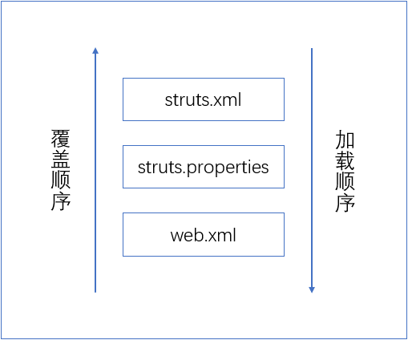

## Struts2 概述

Struts2中大量使用拦截器来处理用户请求，从而允许用户的**业务逻辑控制器Action**与**Servlet API**分离。

Struts2的控制器由两部分组成：

- 核心控制器：**StrutsPrepareAndExecuteFilter**
- 业务逻辑控制器：**Action**

Struts2的配置文件有两种：

- 配置 Struts2 的 struts.**properties** 文件

  ```properties
  # 指定 web 应用的默认的编码及，相当于调用 HttpServletRequest 的 setCharacterEncoding 方法
  struts.i18n.encoding=GBK
  # 当 struts.xml 修改后是否重新加载该文件，在开发阶段最好打开
  struts.configuration.xml.reload=true
  # 设置浏览器是否缓存静态内容，开发阶段最好关闭
  struts.serve.static.browserCache=false
  ```

- 配置 Action 的 struts.**xml** 文件

#### 2.1.6 Struts2 的处理步骤（Struts2 处理请求直到返回响应的完整过程）（一定考）

1. 客户端浏览器发送一个请求
2. 经过核心控制器 **StrutsPrepareAndExecuteFilter** 过滤处理，转交给相应的 **Action** 代理。
3. **Action** 通过配置文件中的信息找到对应的 **Action** 类，创建 **Action** 对象并调用其 **execute()** 方法
4. 调用 **Action** 前后，涉及相关拦截器的调用。拦截器链自动对请求应用通用功能
5. 一旦 **Action** 执行完毕，找到 **execute()** 方法返回值对应的结果

#### 2.1.6 PPT 上的处理步骤

1. 客户端/浏览器发送请求，J2EE 容器解析 HTTP 包，将其封装成 HttpServletRequest。传到核心控制器StrutsPrepareAndExecuteFilter 中
2. StrutsPrepareAndExecuteFilter 拦截到这个请求，进行过滤处理，根据请求路径到 ActionMapper 中查询决定调用哪个 **Action**
3. 根据 ActionMapper 的返回结果，StrutsPrepareAndExecuteFilter 委托 **Action** 代理（Proxy）去配置文件 struts.xml 中找到这个 **Action** 
4. **Action** 代理创建一个 **Action** Invocation，开始对拦截器和 **Action** 进行递归调用
5. 各个拦截器完成各自任务，拦截器链自动对请求应用通用功能。例如自动化工作流、验证或文件上传
6. 真正对 **Action** 的调用，回调 **Action** 的execute()方法，获取用户请求执行相应的业务逻辑，返回一个字符串作为处理结果
7. **Action** 代理根据 struts.xml 中的配置信息找到 execute() 返回值对应的结果
8. Result对象将返回数据输出到流中
9. 返回HttpServletResponse给J2EE容器，容器发送HTTP包到客户端。

## Strust2 深入

配置常量的方式：

- struts.xml
- struts.properties
- web.xml



**struts.xml** 中配置了一个常量A，**web.xml** 中也配置了常量A，那么先加载 **struts.xml**，即 **web.xml** 会覆盖 **struts.xml**

配置常量的代码：

- struts.xml

```xml
<struts>
    <constant name="" value=""/>
</struts>
```

- struts.properties

```properties
key=value
```

#### 3.1.3 命名空间配置

目的：避免同名 <u>**Action**</u> 之间的冲突

- struts.xml:

```xml
<struts>
	<package name="p1" extends="struts-default" namespace="/admin">
    	<action name="login" class="">
        	<result name="error">/error.jsp</result>
            <result>/success.jsp</result>
        </action>
    </package>
</struts>
```

struts2 搜索 <u>**Action**</u> 的顺序：

1. 查找指定命名空间下的 <u>**Action**</u> ，如果找到则执行。
2. 如果找不到，则转入到默认命名空间中查找 <u>**Action**</u> ，找到则执行。
3. 如果还找不到 <u>**Action**</u> ，则 Struts2 将报错。

### 3.2 Action 详解（很重要）

1. 对于使用 Struts2 框架开发的应用而言，<u>**Action**</u> 是应用的核心,每个 **Action**类就是一个**工作单元**,包含了对用户**请求的处理逻辑**,因此 <u>**Action**</u> 也被称为**业务控制器**。
2. 在开发过程中，开发者需要根据处理逻辑的不同写出相应的 <u>**Action**</u> 类,并在 struts.xml 文件中配置好每个 <u>**Action**</u> 类。

#### 3.2.1 Action 实现（掌握代码）

- POJO 实现方式

  - ```java
    public class POJOAction{
      private String name;
      
      public String getName(){
          return name;
      }
      public void setName(String name){
          this.name=name;
      }
      
      public String execute(){
          // 略
          return "OK";
      }
    }
    ```
    
  - ```xml
    <struts>
        <package name="Reg" extends="struts-default">
            <action name="Reg" class="">
                <result name="ok">xxx.jsp</result>
            </action>
        </package>
    </struts>
    ```

  - POJO 实现方式：就是一个简单的 **JavaBean**，每个属性对应 **get**/**set** 方法，并有 **execute()** 方法，其返回字符串，Struts2 框架对该字符串进行判断，从而转发到正确的界面用于响应用户的请求。

- 实现 <u>**Action**</u> 接口

  - ```java
    public interface Action{
        //定义静态常量
        public static final String SUCCESS = "success";
        public static final String ERROR = "error";
        
        //execute 方法
        public String execute() throws Exception;
    }
    ```

  - 该结构提供了一个开发 <u>**Action**</u> 的通用规范（接口）。

  - ```java
    public class RegAction implements Action {
        public String execute{
            return SUCCESS;
        }
    }
    ```

- 继承 **<u>Action</u>Support** 类

  - ```java
    public class RegAction extends ActionSupport{
        public String execute{
            return SUCCESS;
        }
        public void validate(){//数据校验方法
            if(this.name == null || this.name.equals("")){
                addFieldError("name","用户名不能为空！");
            }
        }
    } 
    ```

  - **<u>Action</u>Support** 类是 Struts2 缺省的 **<u>Action</u>** 处理类，当用户配置 **<u>Action</u>** 类没有指定 class 属性时，系统自动使用该类处理请求。

  - validate() 在执行 execute() 之前运行，如果发现数据不符合条件，将执行 addFieldError()

#### 3.2.2 Action 访问 ActionContext（问答or多选）

通过 **ActionContext** 来访问 **Servlet API** 。

**ActionContext** 是 **<u>Action</u>** 执行的上下文，用于存放 **<u>Action</u>** 需要用到的 **Servlet** 相关对象（request、session...），每次执行 **<u>Action</u>** 之前都会为每个 **<u>Action</u>** 创建一个 **ActionContext** 对象的副本，在多线程环境下不会发生线程访问问题。

**<u>Action</u>** 访问 **ActionContext** 的方式：

```java
public class CounterAction extends ActionSupport{
    public String execute{
        ActionContext ctx = ActionContext.getContext();
        Integer counter = (Integer)ctx.getApplication().get("counter");
        ctx.getApplication().put("counter",counter);
        return SUCCESS;
    }
}
```

#### 3.2.3 Action 直接访问 Servlet API （问答or多选）:1234::1234::1234::1234::1234::1234::1234:

**以 ServletRequestAware** 接口为例，通过获取 **HttpSession**，来统计每个浏览器用户访问的次数。

```java
public class CounterAction extends ActionSupport implements ServletRequestAware{
    private HttpServletRequest request;
    public void setServletRequest(HttpServletRequest request){
        this.request=request;
    }
    public String execute(){
        HttpSession session = request.getSession();
        Integer cout = (Integer)session.getAttribute("counter");
        if(cout == null){
            cout = 1;
        }else{
            cout++;
        }
        session.setAttribute("counter",cout);
        return SUCCESS;
    }
}
```

第三种方法：ServletActionContext 直接访问 Servlet API

#### 3.2.5 动态方法调用（也很重要 加上 3.2.6 共三种方式 如何使用 考 Action 实现）

DMI（Dynamic Method Invocation，动态方法调用）

actonName **!** methodName.action

```java
public class UserAction extends ActionSupport{
    public String edit(){
        return "edit";
    }
    public String del(){
        return "del";
    }
}
```

#### 3.2.6 通配符配置

```xml
<struts>
	<package name="" extends="">
    	<action name="*" class="" method="{1}">
        	<result name="success">success.jsp</result>
            <result name="del">del.jsp</result>
        </action>
    </package>
</struts>
```

### 3.3 处理结果（了解）

#### 3.3.2 result 配置

- 局部结果：将 **\<result>** 元素作为 **\<action>** 元素的子元素配置

  - ```xml
    <action>
    	<result name="" type="dispatcher">/xxx.jsp</result>
    </action>
    ```

  - ```xml
    <action>
    	<result>/xxx.jsp</result>
    </action>
    ```

- 全局结果：将 **\<result>** 元素作为 **\<global-results>** 元素的子元素配置

  - ```xml
    <global-results>
    	<result>/xxx.jsp</result>
    </global-results>
    <action></action>
    ```

局部结果会覆盖全局结果。

#### 3.3.3 result 类型

- **dispatcher** 请求转发

- **redirect** 重定向

  - 会丢失所有的请求参数、请求属性，同时 Action 的处理结果也会丢失。
  - 当时用 redirect 时，系统实际上会调用 HttpServletResponse 的 sendRedirect() 方法来重定向指定视图资源，这种重定向的效果就是产生一个新的请求。

- **redirectAction**

  - 当需要 Action 处理结束后，直接将请求重定向到另一个 Action 时，可以通过配置 redirectAction 结果类型来实现。

    - actionName：该参数指定**重定向**的 Action 名称
    - namespace：该参数指定**重定向**的 Action 所在的命名空间

  - ```xml
    <action>
    	<result type="redirectAction">
        	<param name="actionName">listuser</param>
            <param name="namespace">/user</param>
        </result>
    </action>
    ```

#### 3.3.4 动态 result

```xml
<action name="*" class="" method="{1}">
	<result>/{1}.jsp</result>
</action>
```

### 3.4 异常处理

#### 3.4.2 异常的配置

Struts2 的异常处理是通过在 struts.xml 中配置 \<exception-mapping> 元素

```xml
<action>
	<exception-mapping result="error" exception=""/>
</action>
```

## 4 Struts2 标签库（单选、判断）

### 4.1 Struts2 标签库概述

自定义标签库的优势：

1. 使用简单
2. 可维护性强
3. 复用性高

JSTL（JSP Standard Tag Library，JSP 标准标签库）

#### 4.1.2 标签库的组成

- UI（User Interface，用户界面）标签：
  - 生成 HTML 元素
- 非 UI 标签：
  - 数据访问、逻辑控制
- Ajax 标签：
  - 支持 Ajax 技术

### 4.2 OGNL

OGNL（Object Graph Navigation Language，**对象图导航语言**）是一种表达式语言。可以**存取对象**的任意**属性**，**调用对象**的**方法**...

是 Struts2 框架默认的表达式语言。

### 4.3 数据标签

| 标签名   | 描述                                               |
| -------- | -------------------------------------------------- |
| property | 输出某个值，该值可以是值栈 or ActionContext 中的值 |
| param    | 设置参数                                           |
| bean     | 创建 JavaBean 实例                                 |
| set      | 设置一个新的变量，并把新变量存储到特定的范围中     |
| include  | 包含其他页面资源                                   |
| url      | 生成一个特定的 URL                                 |

```xml
<s:property value=""/>

<s:param name="" value=""/>

<s:bean name="">
	<s:param name="" value=""/>
    <s:property value=""/>
</s:bean>

<s:set name="" value="" scope=""/>

<s:include value=""/>

<s:url value=""/>
```

### 4.4 控制标签p83

### 4.5 主题和模板p89

### 4.6 表单标签p91

### 小结

