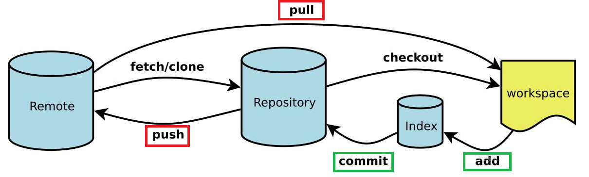

# review

通过 Typora 加载 md 文档，以获得最佳阅读体验。

Typora下载连接：https://www.typora.io/

## Git 的使用说明：

- 工作区->暂存区：`git add .`

- 暂存区->版本库：`git commit -m "提交备注"` 

- 版本库->服务器：`git pull` + `git push` 必须依次执行两个步骤

**暂存区**是**工作区**用来提交更改（commit）前可以暂存工作区的变化。
